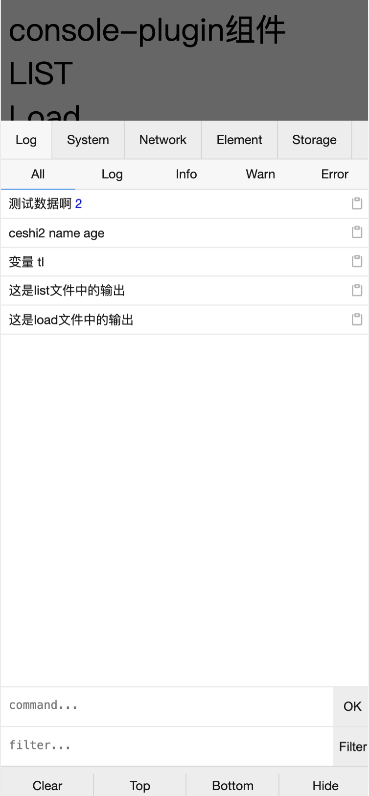
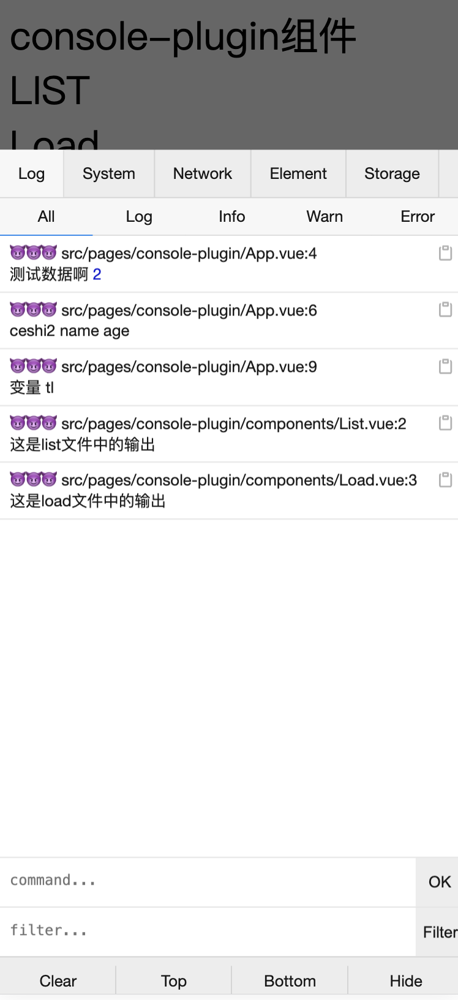
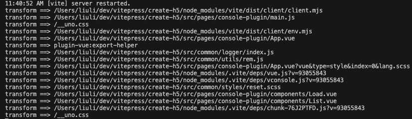
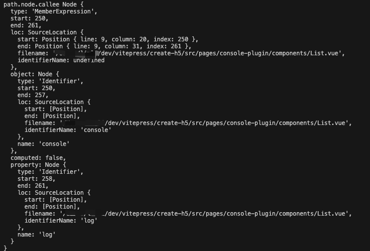
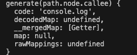
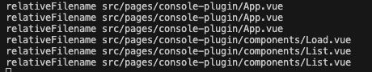
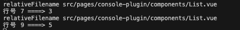
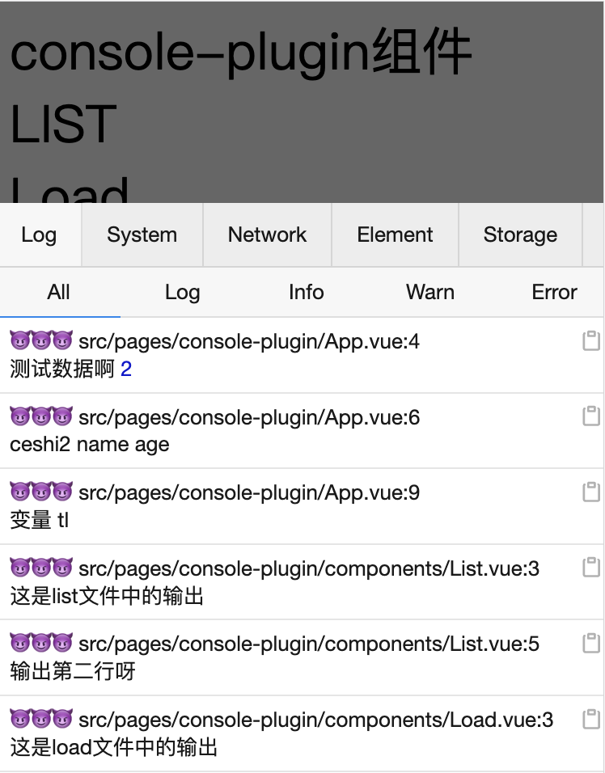
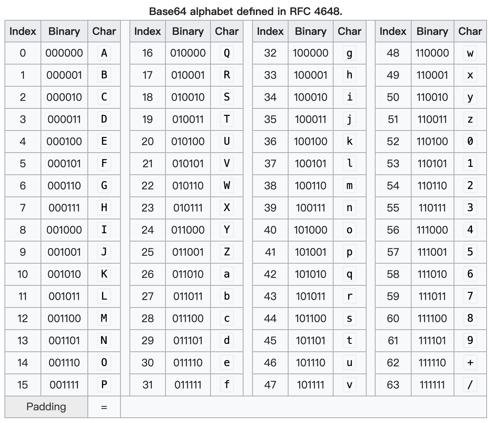

# 从0开始写一个vite-console-plugin

## 背景
h5开发中经常会用console进行调试，有时候console多了难以查找是在哪里打印出的console，如下左图所示；期望改造后的console如下右图，可以打印出当前console所在的文件，行数
| 改造前        |      改造后      | 
| ------------- | :-----------: | 
| |  | 

## 认识插件
1. rollup插件是一个对象，具有 属性、构建钩子、输出生成钩子中的一个或多个，并遵循特定的约定。当前已经有很多插件供开发者直接使用了，插件列表见https://github.com/rollup/awesome
2. 约定  
插件的名称：vite插件应该带有vite-plugin-xxx，不使用vite特有的钩子插件应该叫rollup-plugin-xxx，如果只适用于特定的框架，应该叫vite-plugin-vue-xxx
3. rollup 插件开发 https://cn.rollupjs.org/plugin-development/#load
4. vite 插件API https://cn.vitejs.dev/guide/api-plugin#plugin-ordering

## Coding Time
1. 新建一个vite-plugin-console.js文件，在vite.config.js中引入该空插件
vite-plugin-console.js
```javascript
export default function viteConsolePlugin(options = {}) {
}
```
vite.config.js
```javascript
import consolePlugin from './src/common/plugins/console-plugin';
export default defineConfig({
  plugins: [
    ...
    consolePlugin({
       preTip:'😈😈😈'
    }),
  ]
})
```
2. 在 viteConsolePlugin 返回一个对象，此时我们可以看到，插件已经运行起来了
```javascript
export default function viteConsolePlugin(options = {}) {
  return {
    name: 'vite-console-plugin',
    
    transform(code, id) {
      console.log('transform==>',id)
    }
  };    
}
```

3. 找到我们要处理的文件，即.vue、.js文件，这里用到[createFilter(include?, exclude?, options)](https://github.com/rollup/plugins/tree/master/packages/pluginutils#createfilter)对输入的id进行过滤。include和exclude个格式 `String | RegExp | Array[...String|RegExp]`
```javascript
const filter = createFilter(
  [/\.[jt]sx?$/, /\.vue$/],
  [/[\\/]node_modules[\\/]/, /[\\/]\.git[\\/]/],
);
```
然后在transform中使用 `if (!filter(id)) return;` 对不符合的模块进行拦截。

4. 按照需求开干
::: tip
工具介绍Babel
- @babel/parse，第一步parse(code, [options]);将js代码转唯AST
- @babel/traverse，第二步遍历每一个节点
- @babel/types，第三步找到函数调用节点 console.log ，将其参数改成先输出文件名，再输出行号，最后输出原始log
- @babel/generator，生成新的js代码
:::
#### I 用parse将code 转成 ast
```javascript
import { parse } from '@babel/parser';

...
const ast = parse(code, {
  sourceType: 'unambiguous',
  sourceFilename: id,
});
...
```

#### II 遍历查找出 traverse  
#### III 找到函数名为console.log的语句，由AST可知，path.node.callee存储的是函数名，我们把它打印出看看

然后需要将其转为代码后进行对比

所以通过 `generate(path.node.callee).code` 取得正确的console.log语句后进行后续操作
```javascript
import _generate from '@babel/generator';
const generate = _generate.default;

traverse(ast, {   
  CallExpression(path){
    const calleeCode = generate(path.node.callee).code;
    if(calleeCode === CONSOLE_FUN){
    }
  }
})
```
`找出文件名 和 源代码的行号 `   
  - id就是绝对路径的文件名，获取其相对路径，把root隐藏掉。 
  ```javascript
      let root = '';
      // 拿到root
      configResolved(config) {
        root = config.root;
      },
      // 获取相对路径
      const relativeFilename = id.replace(`${root}/`, '').split('?')[0];

  ```
  
  + 通过 `path.node?.loc?.start?.line;` 拿到代码的行号，发现并不是源码里的行号，这里其实是拿到编码后的行号。为了拿到源码里的行号则需要通过sourcemap的originalPositionFor反解析出源码里的行，列。
  ```javascript
    async transform(code, id) {
      if(!filter(id)) return

      const ast = parse(code, {
        sourceType: 'unambiguous',
        sourceFilename: id,
      });

      // this.getCombinedSourcemap 获取文件的source map
      const rawSourcemap = this.getCombinedSourcemap();
      const consumer = await new SourceMapConsumer(rawSourcemap);

      traverse(ast, {
        
        CallExpression(path){
          const calleeCode = generate(path.node.callee).code;
          if(calleeCode === CONSOLE_FUN){
            // 获取文件名
            const relativeFilename = id.replace(`${root}/`, '').split('?')[0];
            console.log('relativeFilename', relativeFilename)
            // 获取loc
            const {line, column} = path.node?.loc?.start;
            const { line: originStartLine } = consumer.originalPositionFor({ line, column }) || {};

            console.log('行号', line ,'====>', originStartLine)
          }
        }
      })
    }
  ```
  

  + 改变console的参数
  ```javascript
  const nodeArgs = path.node.arguments;
  const startLineTipNode = stringLiteral(`${getPrefix(relativeFilename, originStartLine)}${getFilePath(relativeFilename, originStartLine)}\n`);
  nodeArgs.unshift(startLineTipNode)
  ```


#### IV 只需要重新生成ast返回即可，大公告成，完整代码见[github](https://github.com/Ailinglove/create-h5/blob/main/src/common/plugins/console-plugin.js)
```javascript
transform(code, id){
  ...
  const { code: newCode, map } = generate(ast, {
    sourceFileName: id,
    retainLines: true,
    sourceMaps: true,
  });

  return {
    code: newCode,
    map,
  };  
}
```
  


## sourcemap
1. 我们都知道，线上的代码都是经过编译、压缩、打包之后的代码，如果线上出了问题排查会很难，因为报错行和原始代码行数不一样，所以为了通过压缩后的代码行转化为源码的行就需要用到sourcemap； sourcemap 是一个文本信息，记录代码被转化前后的代码的位置的信息。格式如下
```json
{
  "version": 3, // sourcemap的版本号
  "mappings": ";;;;AAAc;AACd;AACA;AACA;AACA", // 记录位置信息的base64-vlq编码
  "names": [], // 源码所有的变量名和属性
  "sources": [ // 源码文件路径
    "/dev/vitepress/create-h5/src/pages/console-plugin/components/List.vue"
  ],
  "sourcesContent": [ // 源代码
    "<script setup>\n/* eslint-disable */console.log(...oo_oo(`390991493_2_0_2_27_4`,'这是list文件中的输出'))\n"
  ],
  "file": "/dev/vitepress/create-h5/src/pages/console-plugin/components/List.vue" // 转化后的文件名
}
```
由此可知，重点是mappings，分为3层，第一层以分号(;)分割，代表几行，第二层以逗号(,)分割，表示对应转换后源码的位置，第3层表示位置，即该位置对应转换前的位置
```javascript
; // 第一行
; // 第二行
; // 第三行
; // 第四行
AAAc; // 第五行 有一个位置
AACd; // 第六行 有一个位置
AACA; // 第7行 有一个位置
AACA; // 第8行 有一个位置
AACA  // 第9行 有一个位置
```
::: tip
- 第一位，表示这个位置在（转换后的代码的）的第几列。
- 第二位，表示这个位置属于sources属性中的哪一个文件。
- 第三位，表示这个位置属于转换前代码的第几行。
- 第四位，表示这个位置属于转换前代码的第几列。
- 第五位，表示这个位置属于names属性中的哪一个变量。
:::

2. ase64-vlq编码原理


实例：对数值3转换为vlq编码
::: tip
- 将3写成二进制形式 00011
- 在最右边补充符号位，大于0补充0，小于0补充1，即000011
- 从右边的最低位开始，将整个数每隔5位，进行分段，即变成0和00011两段。如果最高位所在的段不足5位，则前面补0，因此两段变成00000和00011
- 将两段的顺序倒过来，即00011和00000
- 在每一段的最前面添加一个"连续位"，除了最后一段为0，其他都为1，即变成100011和000000
- 查表可知 100011 为j ，000000为A
:::


 ## 参考
 [JavaScript Source Map详解](https://www.ruanyifeng.com/blog/2013/01/javascript_source_map.html)


