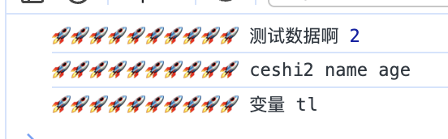

# 从0开始写一个console-plugin

## 背景
h5开发中经常会用console进行调试，有时候console多了难以查找是在哪里打印出的console，如下图所示

期望改造后的console如下图，可以打印出当前console所在的文件，行数


## 认识sourcemap
1.  sourcemap 是一个文本信息，记录代码被转化前后的代码的位置的信息。格式如下
```json
{
  "version": 3, // sourcemap的版本号
  "mappings": ";;;;AAAc;AACd;AACA;AACA;AACA", // 记录位置信息的base64-vlq编码
  "names": [], // 源码所有的变量名和属性
  "sources": [ // 源码文件路径
    "/dev/vitepress/create-h5/src/pages/console-plugin/components/List.vue"
  ],
  "sourcesContent": [ // 源代码
    "<script setup>\n/* eslint-disable */console.log(...oo_oo(`390991493_2_0_2_27_4`,'这是list文件中的输出'))\n"
  ],
  "file": "/dev/vitepress/create-h5/src/pages/console-plugin/components/List.vue" // 转化后的文件名
}
```
由此可知，重点是mappings，分为3层，第一层以分号(;)分割，代表几行，第二层以逗号(,)分割，表示对应转换后源码的位置，第3层表示位置，即该位置对应转换前的位置
```javascript
; // 第一行
; // 第二行
; // 第三行
; // 第四行
AAAc; // 第五行 有一个位置
AACd; // 第六行 有一个位置
AACA; // 第7行 有一个位置
AACA; // 第8行 有一个位置
AACA  // 第9行 有一个位置
```
::: tip
- 第一位，表示这个位置在（转换后的代码的）的第几列。
- 第二位，表示这个位置属于sources属性中的哪一个文件。
- 第三位，表示这个位置属于转换前代码的第几行。
- 第四位，表示这个位置属于转换前代码的第几列。
- 第五位，表示这个位置属于names属性中的哪一个变量。
:::

2. ase64-vlq编码原理


实例：对数值3转换为vlq编码
::: tip
- 将3写成二进制形式 00011
- 在最右边补充符号位，大于0补充0，小于0补充1，即000011
- 从右边的最低位开始，将整个数每隔5位，进行分段，即变成0和00011两段。如果最高位所在的段不足5位，则前面补0，因此两段变成00000和00011
- 将两段的顺序倒过来，即00011和00000
- 在每一段的最前面添加一个"连续位"，除了最后一段为0，其他都为1，即变成100011和000000
- 查表可知 100011 为j ，000000为A
:::

## coding time
plugin.js

```javascript
import _traverse from '@babel/traverse';
import { parse } from '@babel/parser';
import _generate from '@babel/generator';
import { createFilter } from 'vite';
import { SourceMapConsumer } from 'source-map';
const traverse = _traverse.default;
const generate = _generate.default;

function stringLiteral(value) {
  const stringLiteralNode = {
    type: 'StringLiteral',
    value,
  };
  return stringLiteralNode;
}

function getFilePath(filePath, lineNumber) {
  if (!filePath) return '';
  return `${filePath}:${lineNumber}`;
}


const DEFAULT_PRE_TIP = '🚀🚀🚀🚀🚀🚀🚀🚀🚀🚀';
const CONSOLE_FUN = 'console.log';

export default function exportLogPlugin(options = {}) {
  const {
    preTip = DEFAULT_PRE_TIP,
    endLine: enableEndLine = false,
  } = options;


  let root = '';
  const filter = createFilter(
    [/\.[jt]sx?$/, /\.vue$/],
    [/[\\/]node_modules[\\/]/, /[\\/]\.git[\\/]/],
  );

  function getPrefix(relativeFilename, lineNumber) {
    return `${preTip} ${relativeFilename ? '' : `line:${lineNumber} `}`;
  }
  return {
    name: 'console-plugin',
    configResolved(config) {
      root = config.root;
    },
    enforce: 'post',
    async transform(code, id) {
      if (!filter(id)) return;
      const rawSourcemap = this.getCombinedSourcemap();

      console.log('sourcemap',rawSourcemap)

      const consumer = await new SourceMapConsumer(rawSourcemap);
      const ast = parse(code, {
        sourceType: 'unambiguous',
        sourceFilename: id,
      });


      traverse(ast, {
        CallExpression(path) {
          const calleeCode = generate(path.node.callee).code;

          if (calleeCode === CONSOLE_FUN) {
            const nodeArgs = path.node.arguments;
            const { loc } = path.node;

            if (loc) {
              const { line, column } = loc.start;
              // 根据originalPositionFor 找到代码中原始的位置
              const { line: originStartLine } = consumer.originalPositionFor({ line, column }) || {};
              const relativeFilename = id.replace(`${root}/`, '').split('?')[0];

              const startLineTipNode = stringLiteral(`${getPrefix(relativeFilename, originStartLine)}${getFilePath(relativeFilename, originStartLine)}\n`);
              nodeArgs.unshift(startLineTipNode);
            }
          }
        },
      });

      const { code: newCode, map } = generate(ast, {
        sourceFileName: id,
        retainLines: true,
        sourceMaps: true,
      });

      return {
        code: newCode,
        map,
      };
    },
  };
}
```

vite.config.js
```javascript
import consolePlugin from './src/common/plugins/console-plugin'
export default defineConfig({
  plugins:[
    consolePlugin({
      reTip:'😈😈😈'
      }),
    ]
})

```

## 插件小知识
1. 如何通过sourcemap查到原始代码的行数
只需要把打包后的行列作为参数传入[originalPositionFor](https://github.com/mozilla/source-map#consuming-a-source-map)，即可获得代码的原始行列
```javascript
consumer.originalPositionFor({
  line: 2,
  column: 28,
})
```
2. transform(code, id)
id值得是被打包的文件的绝对路径，常用于解决要对那些文件进行过滤

3. import {createFilter} from 'vite';
createFilter 是 [rollup的pluginutils](https://github.com/rollup/plugins/tree/master/packages/pluginutils#createfilter)
参数，include、exclude、options，详请见文档  

4. this.getCombinedSourcemap 获取文件的source map？  
source map是什么？

5. @babel/parser 中的 parse(code, [options]); 将代码转化为抽象语法树

```
import { createApp } from 'vue';

import _logger from '@logger'
import App from './App.vue';
import 'uno.css'

import '@common/utils/rem'
import '@common/styles/reset.scss';

const app = createApp(App);
window._logger = _logger

app.mount('#app');
```

```
Node {
  type: 'File',
  start: 0,
  end: 249,
  loc: SourceLocation {
    start: Position { line: 1, column: 0, index: 0 },
    end: Position { line: 15, column: 0, index: 249 },
    filename: undefined,
    identifierName: undefined
  },
  errors: [],
  program: Node {
    type: 'Program',
    start: 0,
    end: 249,
    loc: SourceLocation {
      start: [Position],
      end: [Position],
      filename: undefined,
      identifierName: undefined
    },
    sourceType: 'module',
    interpreter: null,
    body: [
      [Node], [Node],
      [Node], [Node],
      [Node], [Node],
      [Node], [Node],
      [Node]
    ],
    directives: []
  },
  comments: []
}
```


6. @babel/traverse 配合traverse一起遍历个更新node节点
traverse  
CallExpression 是 AST 中的一个节点类型，表示函数调用表达式。它包含了函数的标识符（函数名）和传递给函数的参数列表。

当遍历器进入 CallExpression 节点时，改函数会被调用，并传递一个path对象作为参数  

path表示AST节点的路径的对象，用于在遍历器中操作和访问ast

- path.node 表示当前节点的AST节点对象
- path.replaceWith 用于替换当前节点
- path.node.arguments 包含所有参数的数组，可以通过这个数组来改变参数


7. @babel/generator 将ast转换为code

 修改console.log的参数

 ```
  const nodeArgs = path.node.arguments;
   nodeArgs.unshift(stringLiteral(DEFAULT_PRE_TIP))
 ```
 


 ## 参考
 [JavaScript Source Map详解](https://www.ruanyifeng.com/blog/2013/01/javascript_source_map.html)


