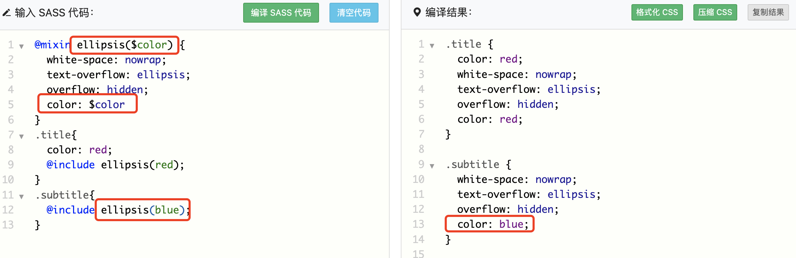

# LESS 和 SCSS
两者都是css扩展语言，极大的简化了css样式的书写
## 变量
- less
```
@mainColor: 'red';
nav{
  color: @mainColor;
}
```

- scss
```
$mainColor: 'red';
nav{
  color: $mainColor;
}
```
## 混合器
简单说就是可以定义一个包含一组样式集的类，其他选择器可以通过调用该类方便使用该集合
- less 函数的方式调用实现
```
.ellipsis{
  white-space: nowrap;
  text-overflow: ellipsis;
  overflow: hidden;
}

.title{
  color: red;
  .ellipsis();
}
.subtitle{
  .ellipsis();
}

```
- scss 通过 @mixin 和 @include 配合实现样式的共享
```
@mixin ellipsis {
  white-space: nowrap;
  text-overflow: ellipsis;
  overflow: hidden;
}
.title{
  color: red;
  @include ellipsis;
}
.subtitle{
  @include ellipsis;
}
```
scss还有更强大的功能，可以给共享样式块传参数如下


## 嵌套
两者写法相同，一下是一个将CSS写法转为扩展器写法的例子
- CSS
```
#content article h1 {
  color: #333;
}
#content article p {
  margin-bottom: 1.4em;
}
#content aside {
  background-color: #EEE;
}
#content:hover {
  color: red;
}
```

- LESS 或者 SCSS
```
#content {
  article {
    h1 { color: #333 }
    p { margin-bottom: 1.4em }
  }
  aside { background-color: #EEE }
  &:hover { color: red }
}
```

这里处理器会把内嵌规则一个个打开，然后父级选择器+空格+子级选择器 逐层拼接。  
伪类是一个特殊的符号`&`表示当前选择器的父级

## 导入
两者写法相同
```
@import "library";
```
## 注释
两者写法相同
```
//
/* 注释 */
```

## sass和scss
sass和scss其实是一样的，scss是sass3引入的新的语法，从版本3.0之后，后缀名变成 .scss。唯一需要注意的是，scss的写法与css一模一样，需要使用分号和花括号。sass 被称为 缩进格式，使用缩进代替花括号，用换行代替分号

less 转 css工具 https://www.matools.com/less  
sass 转 css https://www.dute.org/sass-to-css  
scss: https://www.sass.hk/docs/  
less: https://less.bootcss.com/#%E6%A6%82%E8%A7%88  
