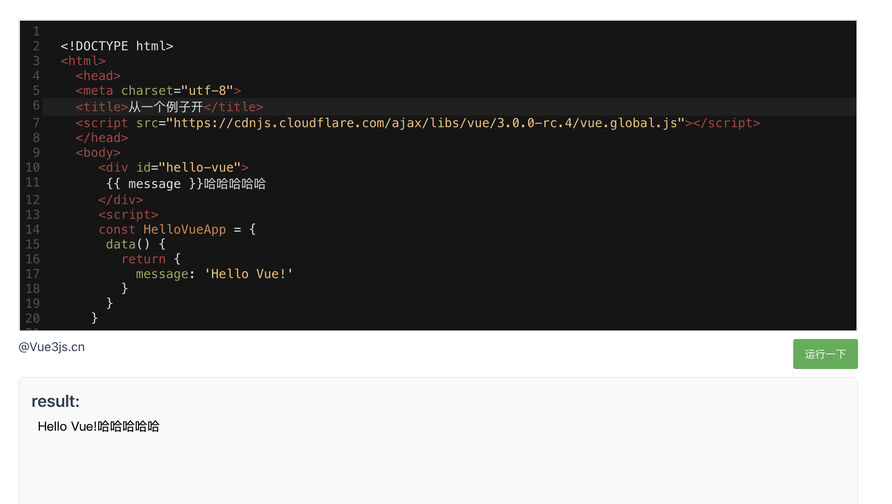

todo 
1. keep-alive 组件缓存 和 在路由中写 keepAlive:true 的区别是啥？
2. https://vue3js.cn/run/start.html 可以通过cdn引用vue 在线运行的页面

3. 学习课程 https://appewiejl9g3764.h5.xiaoeknow.com/p/course/column/p_61fb595ce4b0beaee4275e1e?type=3&share_user_id=u_62301ff390889_lB5gDj5iPW&share_type=5&scene=%E5%88%86%E4%BA%AB&entry=2&entry_type=2002

https://vue3js.cn/reactivity/reactive.html