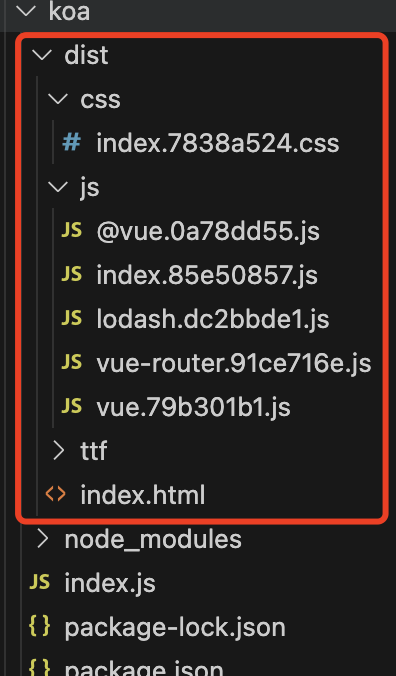
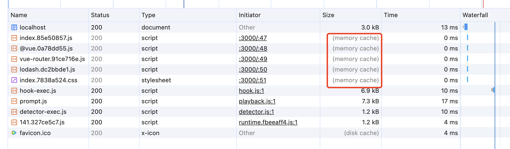
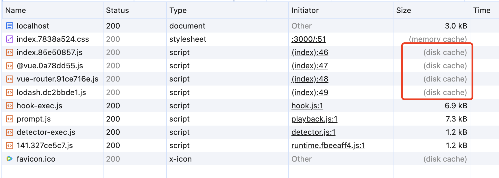
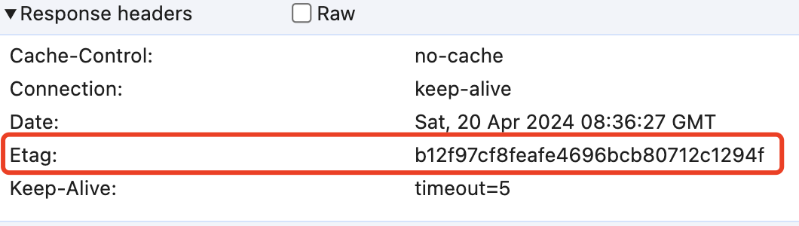
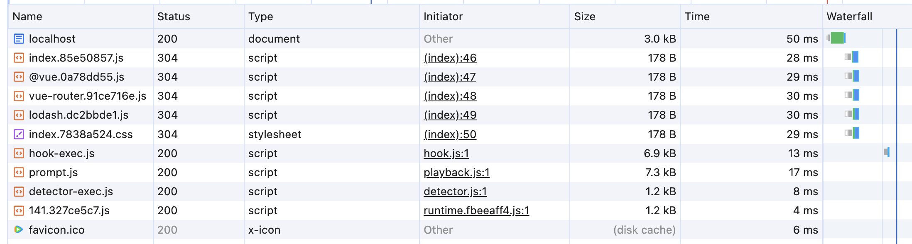
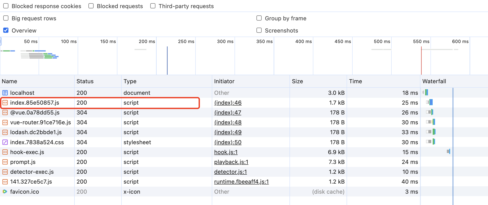
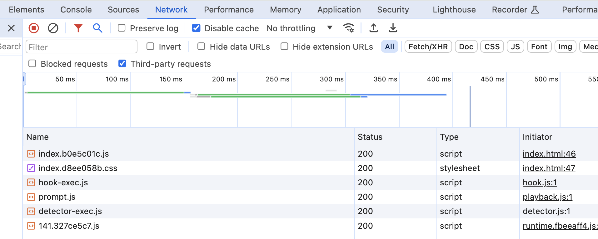
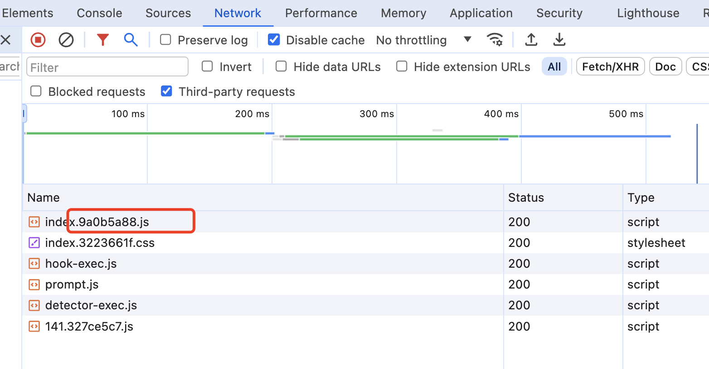
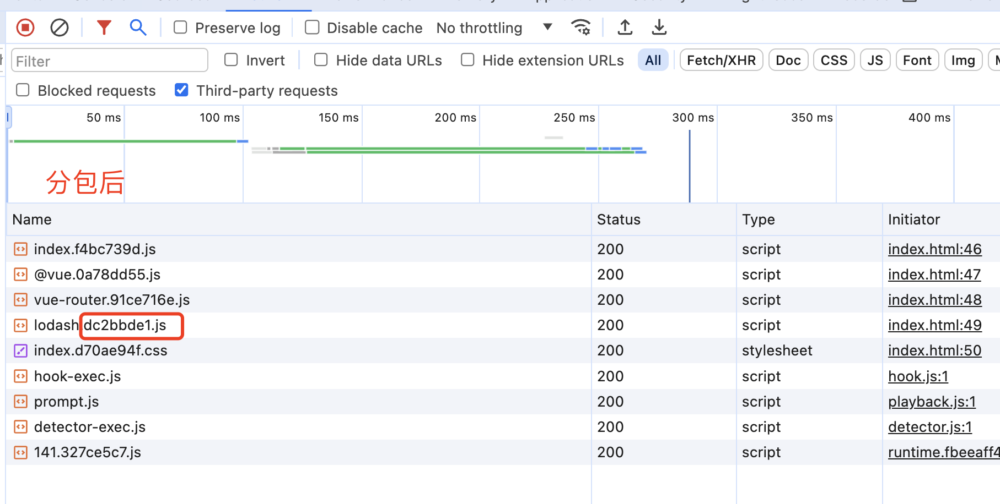
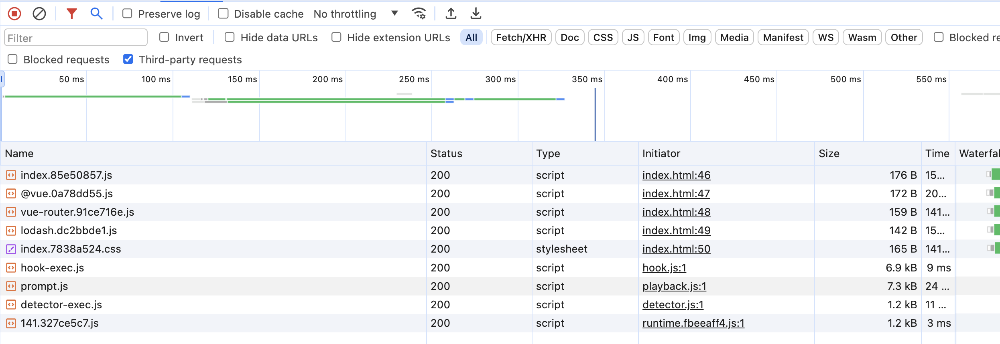

# 性能优化
说起性能优化，首先想到的就是HTTP缓存和减小包体积，但是从没有真正的应用过，今天我将从0开始仔细研究下http缓存。
## 1. HTTP缓存
HTTP缓存分为强缓存和协商缓存，两者都是通过请求头和响应头中的一些字段确定的。
- 强缓存
  - expired 设置过期时间，设置几月几号几点过期
  - cache-control 设置多久后过期 max-age=100，意思是100秒之后过期。 优先级更高。
  - exoired 是HTTP1.0的字段，cache-control是HTTP1.1的字段
  - 原理：
    - 首次请求资源：response-header里有expired或者cache-control
    - 在此请求资源：判断时间是否过期，没有过期则直接从缓存中取，否则向服务端发起请求
- 协商缓存
  - last-modified/if-modified-since 文件的最后修改时间
  - etag/if-none-match 资源的唯一标识符。优先级更高
  - 为什么会存在两种协商缓存？
    - a. last-modified 不能很好的表示文件内容是否更新，比如优势需要隔断时间重新保存次文件，但文件内容实际没有修改，此时期望的是不需要重新请求资源，直接使用缓存就行。但是last-modified有变化。
    - b. last-modified 精度不够只能精确到秒，如果一秒内改了N次文件，last-modifed则不能很好的表示修改时间了。
  - 原理
    - 首次请求：设置response-header cache-control: no-cache;last-modified; etag。
    - 再次请求：request header携带if-modifed-since和if-none-match去请求服务端，服务端根据这两个字段和最新资源的修改时间和etag判断资源是否过期，如果资源有改变，则返回新的文件，状态码是200，否则返回304，表示资源未被修改，从缓存中读取数据。
### coding time
为了验证http缓存，我简单搭了一个服务端，设置header观察其表现。
(1). 初始化项目，安装必要的中间件，koa
```javascript
const Koa = require('koa');
const app = new Koa();
app.listen(3000, () => {
  console.log("listening koa server 3000");
}); 
```
package.json 里边添加script`"dev": "node index.js"` 后，运行 npm run dev，服务端即可运行

(2). 复制一个dist过来，index.html可运行起来

(3). 读取文件，
加了下边这段代码之后，浏览器打开localhost:3000会返回相应的内容，请注意这里if url === '/' 表示的是主动读取html代码进行展示，而else里边的内容则是html中需要引入别的js、css等文件，会走到这里。
```javascript
app.use('/', async(ctx)=>{
  const url = ctx.request.url;
  if (url === '/') {
    // 访问根路径返回index.html
    const filePath = path.resolve(__dirname, "./dist/index.html");
    const html = fs.readFileSync(filePath, "utf8");
    ctx.body = html;
  } else {
    const { request, response } = ctx;
    const filePath = path.resolve(__dirname, `.${url}`);
    const file = fs.readFileSync(filePath, "utf8");
    ctx.body = file;
  }
})
```
此时运行代码 访问 localhost:3000，可以看到页面正常展示。但每次都是200
(4). 设置header
- 强缓存
  设置30s后资源过期`ctx.set("Cache-Control", "max-age=30");`，可以看到 第一次刷新 size 显示每个文件的大小，后5秒内持续刷新，size显示 disk cache或者memory cache，30秒后继续重新向服务端发起请求。


- 协商缓存
协商缓存这里以etag为例，通过crypto获取文件的etag，设置到header上，

下图是第二次刷新时，浏览器带着etag来请求服务端，服务端发现资源没变返回304，可见资源的状态码都是304

我修改index.js的内容之后发现，文件的etag变了，在次刷新后，可见只有index.js的文件的状态码是200，其他依旧是304.


完整代码
```javascript
const Koa = require('koa');
const Router = require('koa-router');
const crypto = require("crypto");

const path =require('path');
const fs = require("fs");
const app = new Koa()

function parseMime(url) {
  const extension = path.extname(url);
  const mimeTypes = {
    ".html": "text/html",
    ".css": "text/css",
    ".js": "application/javascript",
    ".png": "image/png"
    // 其他文件类型的映射
  };

  return mimeTypes[extension];
}

app.use(async (ctx) => {
  const url = ctx.request.url;
  if (url === '/') {
    // 访问根路径返回index.html
    const filePath = path.resolve(__dirname, "./dist/index.html");
    const html = fs.readFileSync(filePath, "utf8");
    ctx.body = html;
  } else {
    const { request, response } = ctx;

    const filePath = path.resolve(__dirname, `.${url}`);
    ctx.set('Content-Type', parseMime(url))
    ctx.set("Cache-Control", "no-cache");
    const file = fs.readFileSync(filePath, "utf8");

    const fileEtag = generateETag(file);
    ctx.set("Etag", fileEtag);
    if (fileEtag === request.header['if-none-match']){
      ctx.response.status = 304;
      ctx.body = null;
    }else{
      ctx.body = file;
    } 
  }
})

function generateETag(data) {
  const hash = crypto
    .createHash("md5")
    .update(data)
    .digest("hex");
  return `${hash}`;
}

app.listen(3000, () => {
  console.log("listening koa server 3000");
}); 


```

## 2. 打包优化
通过以上分析我们可以知道只要浏览器资源没改变就不会重新发起请求，所以打包的优化就可以从不变的文件则单独打包。

以下我以 lodash 包为例展开。以下是我写在vue文件里的代码，引入了lodash并使用了其中的一个方法
```javascript 
import { sampleSize } from 'lodash';
const a = [1, 2, 3, 4, 5];
const b = sampleSize(a, 5);
console.log('======', b);
```
打包后的js文件 index.b0e5c01.js


当我改了一行代码， `console.log('======>======', b);`，再次打包，index.js的哈希值变了，index.js中包含了lodash和我写的代码，而lodash作为第三方包，几千行代码，一般不变不需要重新请求服务端的。

为了避免这种资源的浪费，将node_modules中的第三方包单独打包。对vite.config.js进行配置，rollupOptions.output.manualChunks，这里的manualChunks的参数id是依赖图中每个文件的路径，如果函数返回字符串，那么该模块及其所有依赖将被添加到以返回字符串命名的自定义 chunk 中。所以我们把node_modules中的文件按类别进行打包。

```javascript
{
  build: {
    rollupOptions:{
      output:{
        manualChunks: (id)=>{
          if (id.includes('node_modules')) { // 对node_modules进行拆包
            return id.toString().split('node_modules/')[1].split('/')[0].toString();  // lodash\router分类打包
          }
        },
        chunkFileNames: 'js/[name].[hash].js',
      }
    }
  }
}
```

分包后可以看到lodash被单独打包成一个js文件lodash.dc2bbde1.js，继续改vue里边的代码
```javascript
const a = [1, 2, 3, 4, 5];
const b = sampleSize(a, 5);

console.log('======>======', b);
console.log('======>======', a);
```
此时 可以看到 lodash还是 lodash.dc2bbde1.js，其hash值没变。这就完成了分包，当非node_modules变化时，node_modules的文件可以继续使用缓存中的数据。
