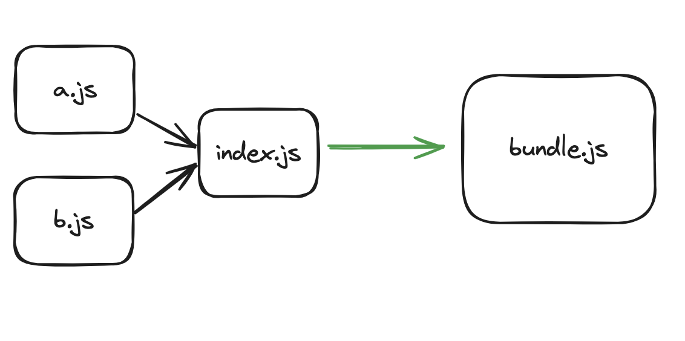
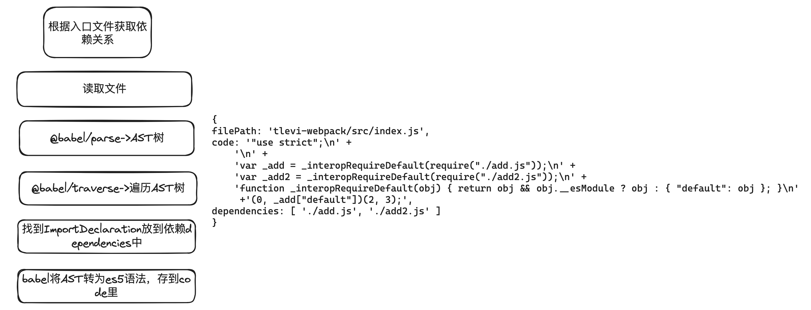

## 手写一个webpack

### 定义
官方定义：webpack 是一个用于现代 JavaScript 应用程序的 静态模块打包工具。当 webpack 处理应用程序时，它会在内部从一个或多个入口点构建一个 依赖图(dependency graph)，然后将你项目中所需的每一个模块组合成一个或多个bundles。

简单说，就是通过分析代码的引用，将多个文件的代码处理成一个多个文件的代码


### 开始写webpack
weboack的工作过程包括：依赖解析和代码打包过程，webpack根据入口文件，递归解析AST和其对应的依赖，得到依赖图。然后为每个模块添加包裹函数，从入口文件为起点，递归执行模块，进行拼接IIFE（立即调用函数表达式，保证了模块变量不会影响全局作用域），产出对应的bundle
#### 1. 依赖解析
- 读取文件内容
- @babel/parse将代码转为ast树
- @babel/traverse遍历AST树，找到ImportDeclaration节点放到依赖dependencies中
- 递归遍历dependencies，对代码进行解析


### 2. 依赖图构建
绝对路径为key，value为模块的code和mapping
模块的code应放在一个函数里 因为每个模块的code中使用了require,exports两个API 需要传入
```
createModules(manifest) {
  let modulesStr = '';
  manifest.forEach(module => {
    const key = JSON.stringify(module.filePath)
    const mapping = JSON.stringify(module.mapping)
    const code = `function(require,module,exports){${module.code}}`
    // 单个模块资源
    const modulesPart = `${key}:[\n ${code},\n ${mapping} \n ],\n`
    modulesStr += modulesPart
  })
 return `{${modulesStr}}`
}
```

### 3. 代码打包
```
createOutputCode(modulesStr) {
  let result = ` 
  // bundle最终生成的代码 
  (function(){
    // 传入modules
    var modules = ${modulesStr}
    // 创建require函数 获取modules的函数代码和mapping对象
    function require(raletivePath){
      const [fn,mapping]  = modules[raletivePath]
      //(loaclRequire 通过相对路径获取绝对路径(id)并执行require)
      const loaclRequire =(relativePath)=>{                    
          return  require(mapping[relativePath])
      }
      //! 构造模拟Node的module对象
      const module = {
          exports:{}
      }
      //! 将三个参数传入fn并执行
      fn(loaclRequire,module,module.exports)
      
      return module.exports
    }

    //! 执行require(entry)入口模块
    require(${JSON.stringify(this.config.entry)})
  })();`
  return result;
}
```
将上述生成的代码写入dist文件中
## webpack 的loader和plugin的区别是什么
- loader是对源码进行转换为js文件，webpack只认识js和json
- plugin 做一些loader无法完成的事情，在webpack打包过程中对某些节点做定制化处理
## todo [编写一个loader](https://webpack.docschina.org/contribute/writing-a-loader/)


## babel
babel是一个语法转换工具链，它将我们的代码通过babel-parser转换为ast树，根据相关配置，转换成最终识别的AST树，再得到目标代码。
- babel-loader 匹配对应的文件
- babel-core 根据babel.config.js或者.balelrc 的配置 用什么规则去进行代码转换，转换用的是babel-core
- babel-preset-env 规则，得到目标代码


## 参考
https://juejin.cn/post/7124958847059361828
