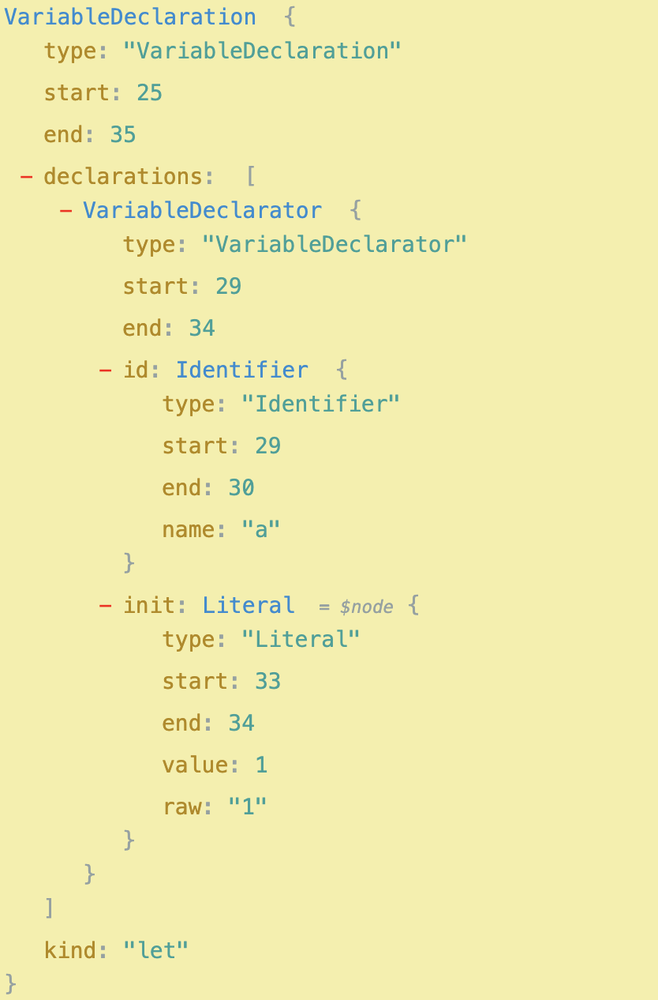
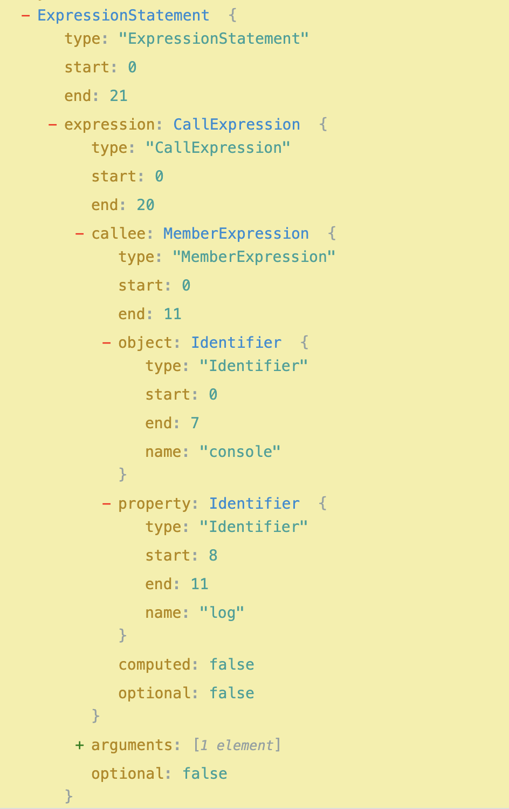
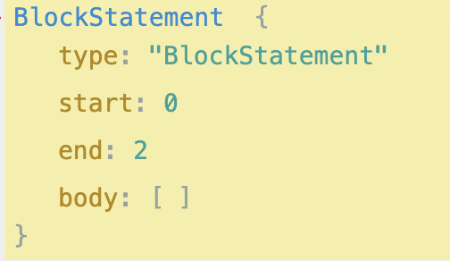
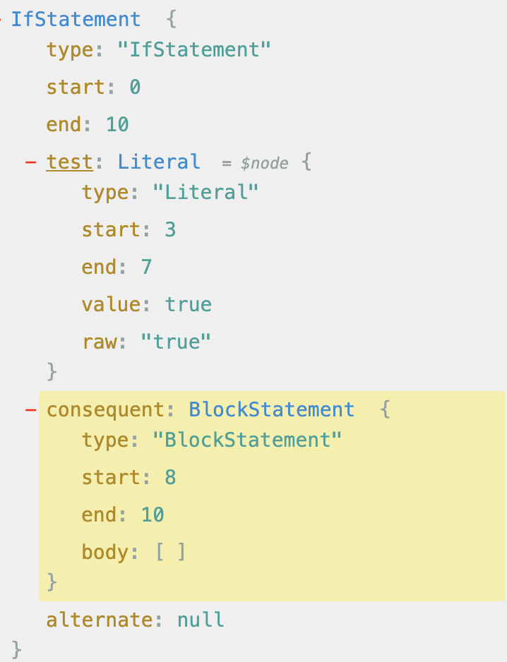
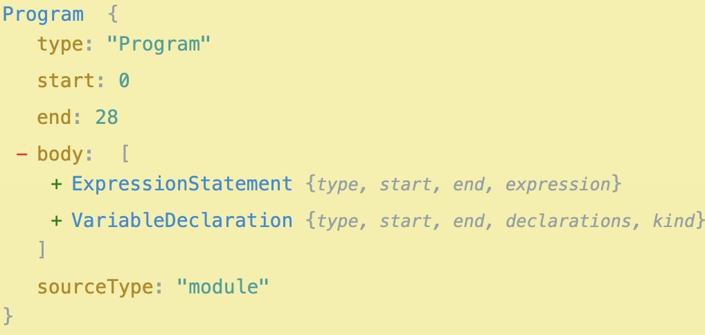

## 什么是抽象语法树？
wiki定义：抽象语法树（Abstract Syntax Tree，AST），或简称语法树（Syntax tree），是源代码语法结构的一种抽象表示。它以树状的形式表现编程语言的语法结构，树上的每个节点都表示源代码中的一种结构。  
看完定义还是有种云里雾里的感觉，实际上抽象语法树是将代码用树状来表示，直接看例子代码`console.log(tlevi);`转为抽象语法树之后的结构。
```javascript
console.log('tlevi');
```

```json
{
  "type": "Program",
  "start": 0,
  "end": 21,
  "body": [
    {
      "type": "ExpressionStatement",
      "start": 0,
      "end": 21,
      "expression": {
        "type": "CallExpression",
        "start": 0,
        "end": 20,
        "callee": {
          "type": "MemberExpression",
          "start": 0,
          "end": 11,
          "object": {
            "type": "Identifier",
            "start": 0,
            "end": 7,
            "name": "console"
          },
          "property": {
            "type": "Identifier",
            "start": 8,
            "end": 11,
            "name": "log"
          },
          "computed": false,
          "optional": false
        },
        "arguments": [
          {
            "type": "Literal",
            "start": 12,
            "end": 19,
            "value": "tlevi",
            "raw": "'tlevi'"
          }
        ],
        "optional": false
      }
    }
  ],
  "sourceType": "module"
}
```
这段json描述了这行代码，type 表示类型，Program 表示整段代码主题，start 表示开始位置，end表示结束位置。最外层有type、start、end、body、sourceType，body是一个数组，记录每一个节点。

|type| 中文译名| 描述 |
|---------| :----------: | :----------: |
|Program||程序主体
|ExpressionStatement||表达式语句，通常指调用一个函数
|CallExpression||函数调用表达式
|MemberExpression||复杂表达式，由原始表达式和操作符组合而成，通常指的是()左边的部分
|Identifier||标识符，通常指变量名
|Literal||字面量，比如  'tlevi', 10
|VariableDeclaration||变量表达式|
|EmptyStatement||空语句节点，比如单独的分号|

- 在线代码转AST https://astexplorer.net/
- 所有的节点类型 @babel/types https://babeljs.io/docs/babel-types


## 常见的语句举例
  <table >
    <tr>
      <th >语句 </th>
      <th >描述 </th>
      <th >图片 </th>
    </tr>
    <tr>
      <td >变量声明语句 </td><td>let a = 1;</td><td></td>
    </tr>
    <tr>
      <td >函数调用语句 </td><td>console.log('tlevi');</td><td></td>  
    </tr>
    <tr>
      <td>块结构</td><td>{}</td><td></td>
    </tr>
    <tr>
    <td >条件判断语句 </td><td>if(true){}</td><td></td>
    </tr>
    <tr>
    <td >两句代码</td><td>console.log(2);let a = 10;</td> <td></td> 
    </tr>
  </table>

  ## AST的生成
  - 读取js文件中的代码，词法分析生成token，token即一个合法的关键字，是不可再被分割的，比如 const、let、coonsole、;、+等，最终生成一个tokens列表
  - 语法分析，生成AST，将词法分析生成的token转化为有语法含义的抽象语法树结构。
  
