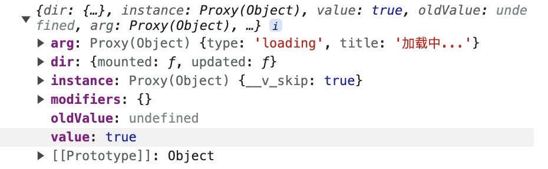

## 指令的理解
1. v-clock 
用于隐藏还没有完成编译的DOM模版，该指令只在没有构建步骤的环境下需要使用。
针对“未编译模版闪现的情况”，即用户会先看到带双大括号的标签，然后再看到内容
2. v-pre
跳过元素及其所有子元素的编译，展示原始的双大括号标签及内容，与v-clock相对

## 自己写一个v-tloading指令 
官方参考文档 https://cn.vuejs.org/guide/reusability/custom-directives.html#custom-directives
1. 先写一个Loading组件，直接引入组件进行调试
```
<script setup>
const src = ref('')
const loadingParams = ref({
  type: 'loading',
  title: '加载中...'
})
const showLoading = ref(true) // 控制loading的显示和隐藏

const data = ref([])
const mockData = ()=>{
  for(let i=0; i<10; i++){
    data.value.push(i)
  }
}
onMounted(() => {
  showLoading.value = true
 // 模拟异步请求
 window.setTimeout(() => {
    mockData()
    showLoading.value = false
  }, 3000)
})  
</script>

<template>
  <div class="box p-20px">
    <div
      v-if="!showLoading"
      class="img-box mt-20px"
    >
      <div
        v-for="item in data"
        :key="item"
        class="h-100px"
      >
        {{ item }}
      </div>
    </div>
    <Loading v-if="showLoading" />
  </div>
</template>

<style>
.box{
  width: 100%;
  height: 100vh;
  position: relative;
}
</style>

```
2. 注册指令
调试没问题之后，在同目录下新建index.js文件，注册tloading指令

```javascript
const loadingDirective = {
  // 挂载
  mounted(el, binding){
    const { value, arg } = binding
  },
  update(){
  }
}
export default {
  install: (app) => {
    app.directive('tloading', loadingDirective)
  }
}
```
el: 是将要挂载指令的dom节点
value: 控制开启和关闭loading  
binding：包括arg、dir、instance、modifiers、oldValue、value

3. 创建loading实例，并挂载
```javascript
 mounted(el, binding){
    const app = createApp(Loading);
    const instance = app.mount(document.createElement('div'));
    el.instalce=instance;
 }
```
4. j将loading指令填到dom上
```javascript
  if(value){
    el.appendChid(el.instalce.$el)
  }
```
5. 在main.js中全局引用指令即可通过v-tloading="showLoading" 使用指令了
```javascript
import MyLoading from './components/loading/index'
app.use(MyLoading);
```
6. 设置删除loading需要在update中根据value对loading组件进行更新，value为true的时候添加loading，value为false的时候，删除loading  
- 添加loading  `el.appendChild(el.instance.$el)`
- 删除loading  `el.removeChild(el.instance.$el)`

7. 向loading传参数，需要通过[`defineExpose`](https://cn.vuejs.org/api/sfc-script-setup.html#defineexpose)编译器宏来显式指定在在 `<script setup>` 组件中要暴露出去的属性
el.instance.setTParams(arg)
loading组件中暴露参数属性
```javascript
const setTParams = (val)=>{
  loadingParams.value = val;
}

defineExpose({
  setTParams,
})
```
组件js文件中需要在mounted和updated的时候分别更新参数
```
  el.instance.setTParams(arg)
```
demo图如下，完整代码查看[github](https://github.com/Ailinglove/create-h5/tree/main/src/pages/loading)


