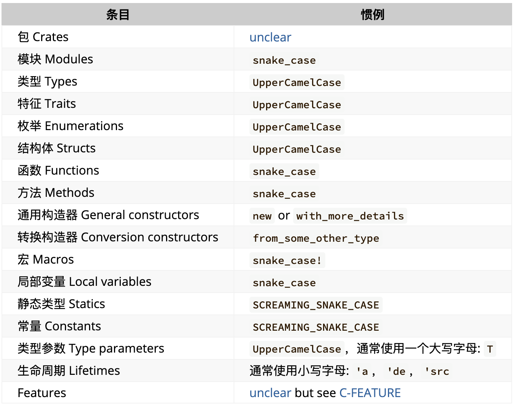
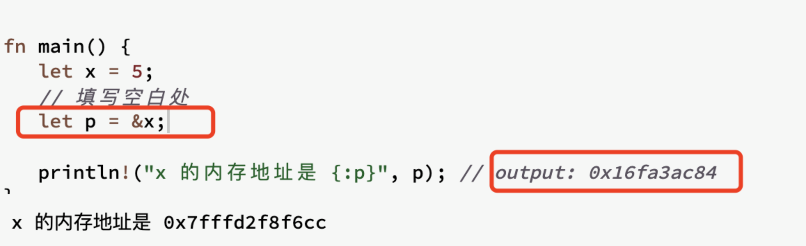

## 命名习惯
type-level: 驼峰
value-level: 蛇形


## 基础语法
1. 变量的绑定
- 变量的绑定，用绑定而非赋值

2. 变量的可变性
默认不可变，重新绑定会报错。

## 引言
如何从内存中申请空间来存放程序的运行内容，如何在不需要的时候释放这些空间？在计算机语言不断演变的过程中，出现三种流派
- 垃圾回收机制GC，在程序运行时不断寻找不再使用的内存，Java Go
- 手动管理内存的分配和释放，在程序中，通过函数调用的方式来申请和释放内存，C++
- 通过所有权来管理内存 编译器在编译时会根据一系列规则进行检查，且检查只发生在编译期，因此对于程序运行期，不会有任何性能的损失 Rust
## 栈和堆(Heap)
以前我们学习的语言中，好像并不需要深入了解栈和堆，但是对于Rust来说，值是位于堆还是栈上非常重要，这回影响程序的行为和性能
- 栈：先进先出，所有数据占用已知大小的内存空间
- 堆：存储大小未知或者可能变化的数据

## String类型
1. 字面值，例如 let s = 'tlevi' 就是字面值，缺点就是字符串的字面值是不可变的，且并不是所有的字符串的值都是能在编写代码时就知道的
2. 动态字符串类型：String，该类型被分配到堆上，因此可以动态伸缩。
```
let name = String::from("tlevi") // :: 表示调用操作符，即调用String模块中的from方法
name.push_str(", 你好！") // push_str 在字符串后边追加字面值
```

## 所有权和借用
所有权原则
:::TIP
1. Rust 中每一个值都被一个变量所拥有，该变量被称为值的所有者
2. 一个值同时只能被一个变量所拥有，或者说一个值只能拥有一个所有者
3. 当所有者(变量)离开作用域范围时，这个值将被丢弃(drop)
:::
也就是说 所有者 和 值 是一一对应的关系
```
let name = 'tlevi'    
```
值'tlevi' 的所有者是name，且只能被name所拥有

### 所有权转移
```
let a = 10
let b = a
```
 原理：拷贝a的值赋值给b，最终x和y的值都等于5

```
let a = String.from("hello")
let b = a
```
这个时候还是a的值是hello，b的值也是hello吗？
由前面 存储在堆上的数据共有堆指针、字符串容量、字符串常量共同组成。这里堆指针指向堆内存，且存储在栈中，所以上边拷贝一个代码分两种情况  
- 拷贝栈上的指针和堆中数据 （深拷贝，性能消耗大）
- 拷贝栈上的指针（一个值被两个变量拥有，违反了所有权规则，所以Rust人为，当b的值被赋予a时，a不再有效，无法访问，这就叫所有权转移了）

也就是说我们之前叫浅拷贝的操作在这里不能叫浅拷贝了，因为拷贝前的变量失效了，因此在rust中这个操作被称为 移动，同时 rust中 let b = a 被称为变量绑定而不是赋值

### 函数传值和返回
```
fn main() {
    let s = String::from("hello");  // s 进入作用域

    takes_ownership(s);             // hello 的所有权移动给了takes_ownership的参数
                                    // ... 所以到这里使用s时，s不再有效

    let x = 5;                      // x 进入作用域

    makes_copy(x);                  // x 应该移动函数里，
                                    // 但 i32 是 Copy 的，所以在后面可继续使用 x

} // 这里, x 先移出了作用域，然后是 s。但因为 s 的值已被移走，
  // 所以不会有特殊操作

fn takes_ownership(some_string: String) { // some_string 进入作用域
    println!("{}", some_string);
} // 这里，some_string 移出作用域并调用 `drop` 方法。占用的内存被释放

fn makes_copy(some_integer: i32) { // some_integer 进入作用域
    println!("{}", some_integer);
} // 这里，some_integer 移出作用域。不会有特殊操作
```

### 引用和借用
刚刚介绍了所有权及所有权转移，通过上述代码只有所有权转移的方式获取一个值，则会使程序变得复杂，所以rust也有借用来获取变量的引用。引用是一个指针类型，指向了对象存储的内存地址。引用用 & 表示

如图所示，p是一个变量，存储的是x的引用，所以打印出来的是一个内存地址，那么如何通过引用访问到引用的值，这就用到了解引用。用*表示，因此 *p就是5

```
fn main() {
    let x = 5;
    let y = &x;

    assert_eq!(5, x);  // assert_eq 判断是否相等
    assert_eq!(5, *y);
    assert_eq!(5, y) // 报错，不同类型不能比较
}
```
#### 不可变引用
 引用在默认情况下是不可变的，这个很好理解，谁都不希望正在引用的这个值被改变
```
fn main() {
    let s = String::from("hello");

    change(&s);
}

fn change(some_string: &String) {
    some_string.push_str(", world");
}
```
#### 可变引用
```
fn main() {
    let mut s = String::from("hello"); // 生命字符串是可变的

    change(&mut s); //可变的引用
}

fn change(some_string: &mut String) { // 接收可变引用参数
    some_string.push_str(", world");
}
```

注：
- 可变引用同时只能存在一个，使Rust在编译期间就避免了数据竞争
- 可变引用和不可变引用不能同时存在

#### 悬垂引用
```
fn main() {
    let reference_to_nothing = dangle();
}

fn dangle() -> &String {
    let s = String::from("hello"); // s 拥有字符串 hello的所有权

    &s // 返回了s的引用，但是函数结束s拥有的值被drop，导致&s无法访问到任何值。
}
```

## 借用规则
- 同一时刻，只能拥有一个可变引用，或者多个不可变引用
- 引用必须总是有效的
## 认识生命周期
生命周期，简而言之说的是引用的有效作用域。七主要作用是避免悬垂引用。

悬垂引用的概念在 所有权和借用中讲过，指的是，一个变量绑定了一个数据的地址，但是数据离开作用域后失效了，变量还在引用它，例子
```
{
  let r;
  {
    let x = 5;
    r = &x;
  }
  !("r: {}", r); // `x` does not live long enough
}
```

## 生命周期标注语法
生命周期标注并不会改变任何引用的实际作用域

生命周期的标注语法
- 以 ' 开头，名称是一个单独的小写字母
- 引用类型 生命周期标注会位于引用符号 & 之后
```
&i32        // 一个引用
&'a i32     // 具有显式生命周期的引用
&'a mut i32 // 具有显式生命周期的可变引用
```

生命周期的标注，本身并没有意义，只是告诉编译器，多个引用之间的关系
```
fn useless<'a>(first: &'a i32, second: &'a i32) {}
```
，例如这行代码，参数first 和second 同时标注了生命周期 'a', 这仅仅说明，这两个参数至少获得和 'a 一样长的生命周期，至于到底哪个活的久，活多久，还是编译器来判断。
判断法则：first 和 second 哪个的生命周期短，就用哪个，这个也很好理解，'a 和两者的生命周期一样，但是有一个先失效了，因此，短的那个就是正确的

```
fn main() {
    let string1 = String::from("long string is long"); // 生命周期到main结束

    {
        let string2 = String::from("xyz"); // 生命周期到内部话括号结束
        let result = longest(string1.as_str(), string2.as_str()); 
        println!("The longest string is {}", result); // 按照以短的为准，还没出话括号，所有有效
    }
}
```

```
fn main() {
    let string1 = String::from("long string is long"); // 生命周期到main结束
    let result;
    {
        let string2 = String::from("xyz");  // 生命周期到内部话括号结束
        result = longest(string1.as_str(), string2.as_str());
    }
    println!("The longest string is {}", result);
}

```

## 深入思考生命周期标注
函数的返回值如果是一个引用类型，那么它的生命周期只会来源于
- 函数参数的生命周期
- 函数体中某个新建引用的生命周期（会导致悬垂引用场景）

// todo 忘记啥叫引用了，复习下字符串那块的引用

　
```
fn longest<'a>(x: &str, y: &str) -> &'a str {
    let result = String::from("really long string");
    result.as_str()
}
fn longest<'a>(_x: &str, _y: &str) -> String {
    String::from("really long string")
}
```

这两者的区别是，后边一段代码是返回了函数内部字符串的所有权，把字符串所有权转移给调用者了，因此不会出现悬垂引用  

生命周期的作用：讲函数的多个引用参数和返回值的作用域关联到一起，从而保证我们的操作是安全的


复习： 引用类型和非引用类型   


