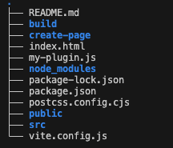

# 学习链接
1. rust 教程  
 https://course.rs/first-try/editor.html
2. js 规范  
 https://github.com/ryanmcdermott/clean-code-javascript
3. 一些不错的网站   
https://juejin.cn/post/7243680457815261221

4. 前端森林  
https://fesites.netlify.app/
5. 一个好用的文档记录app noteable  
https://notable.app/#features

6. 原子化CSS
- tailWindCSS https://www.tailwindcss.cn/docs/installation
- wubdu CSS https://cn.windicss.org/utilities/general/typography.html
- 解释原子化css原理
https://unocss.dev/interactive/?s=leading-20px

8. lottie文件
https://lottiefiles.com/search?q=loading&category=animations&page=2

7. 今天知道一个有趣的指令 tree ，运行`tree  -C -L 1` 即可获取当前的整个目录

- 安装 Homebrew `/bin/bash -c "$(curl -fsSL https://raw.githubusercontent.com/Homebrew/install/master/install.sh)"`
- 安装 tree ```brew install tree`


