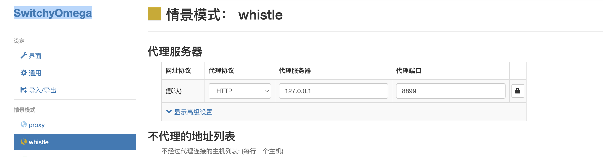
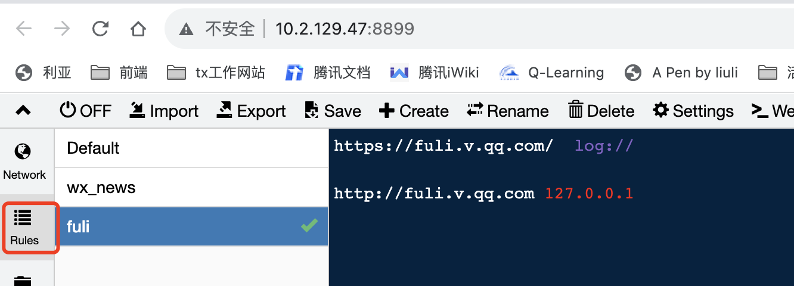
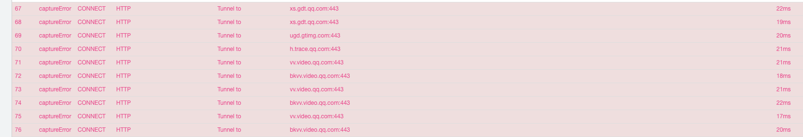

# 环境配置
全局安装tnpm https://iwiki.woa.com/pages/viewpage.action?pageId=4007212107

## whistle 配置
1. 安装wshitle
   http://wproxy.org/whistle/proxy.html
2. switchOmega 谷歌插件下载  

代理到本地
   
3. 打开127.0.0.1:8899，新建rules 填写http://fuli.v.qq.com 即可访问


移动端链接whistle
1. 遇到以下问题

证书不对，下载新的证书安装即可
解决方法:
1. 
微信新闻插件rules
whsitle配置 tfuli.v.qq.com 127.0.0.1:3000

## vscode 配置
配置自动格式化
配置保存是单引号
``` 
{
    "workbench.colorTheme": "Default Dark Modern",
    "editor.tabSize": 2,
    "editor.formatOnPaste": true,
    "editor.formatOnType": true,
    "editor.codeActionsOnSave": {
        


        // "source.fixAll": true
    },
    "rdhelper.cas.status": "tempclose",
    "rdhelper.cas.lastupdatefile": "Users/liuli/Library/Application Support/Code/User/settings.json",
    "editor.formatOnSave": true,
    "editor.formatOnSaveMode": "modifications",
    "[javascript]": {
        "editor.defaultFormatter": "esbenp.prettier-vscode"
    },
    "prettier.semi": false,
    "prettier.singleQuote": true
}
```
