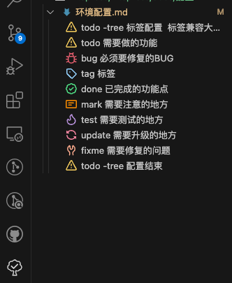
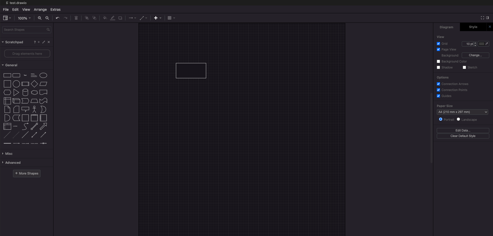
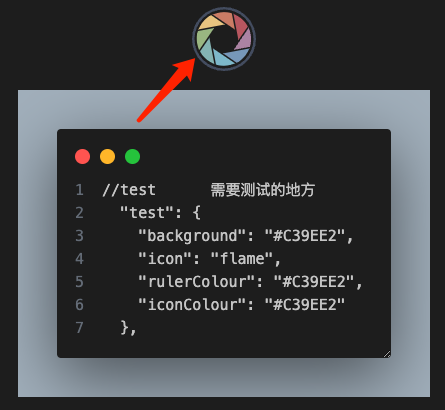

# 环境配置
## 安装n进行node版本管理
1. 安装n `npm install n -g`
2. 检查是否安装 `n -V`
3. 查看已安装的node `n ls`
4. 安装[制定版本的node](https://nodejs.org/zh-cn/download/releases)  `sudo n node版本号`
5. 卸载 `sudo n rm 10.13.1`


## whistle 配置
1. 安装wshitle
   http://wproxy.org/whistle/proxy.html
2. switchOmega 谷歌插件下载  
代理到本地
   
3. 打开127.0.0.1:8899，新建rules 填写http://a.b.c.com 即可访问
http://a.b.c.com 127.0.0.1:3000 此时，访问`http://a.b.c.com`时实际上访问的是本地`127.0.0.1:3000`

4. [移动端链接whistle](https://cloud.tencent.com/developer/article/1861186)
遇到以下问题

证书不对，下载新的证书安装即可
解决方法: 打开默认浏览器 访问 http://rootca.pro/ 下载证书 安装即可


## mac os 在vscode中运行`code .`报错
EACCES: permission denied, unlink '/usr/local/bin/code'
先 shift+command+P -> 输入Shell command , 然后点击uninstall这个选项->确定后指纹验证，
在 shift+command+P -> 输入Shell command , 然后点击 install 即可

## vscode 相关
1. 配置
配置自动格式化
配置保存是单引号
```json
{
    "workbench.colorTheme": "Default Dark Modern",
    "editor.tabSize": 2,
    "editor.formatOnPaste": true,
    "editor.formatOnType": true,
    "editor.codeActionsOnSave": {
        // "source.fixAll": true
    },
    "rdhelper.cas.status": "tempclose",
    "rdhelper.cas.lastupdatefile": "Users/liuli/Library/Application Support/Code/User/settings.json",
    "editor.formatOnSave": true,
    "editor.formatOnSaveMode": "modifications",
    "[javascript]": {
        "editor.defaultFormatter": "esbenp.prettier-vscode"
    },
    "prettier.semi": false,
    "prettier.singleQuote": true
}
```

2. 扩展
- open-in-browser 在浏览器上打开html文件 打开之后的路径是 file://xxx
- live server 通过服务器打开html文件 打开之后的路径是 http://127.0.0.1:5500/index.html
- Todo Tree 快速定位自己再代码中写过的todo bug等

```json
{
     //todo-tree 标签配置  标签兼容大小写字母(很好的功能!!!)
  "todo-tree.regex.regex": "((%|#|//|<!--|^\\s*\\*)\\s*($TAGS)|^\\s*- \\[ \\])",
  "todo-tree.general.tags": [
    "todo", //添加自定义的标签成员,将在下面实现它们的样式
    "bug",
    "tag",
    "done",
    "mark",
    "test",
    "update",
    "fixme"
  ],
  "todo-tree.regex.regexCaseSensitive": false,
  "todo-tree.highlights.defaultHighlight": {
    //如果相应变量没赋值就会使用这里的默认值
    "foreground": "black", //字体颜色
    "background": "yellow", //背景色
    "icon": "check", //标签样式 check 是一个对号的样式
    "rulerColour": "yellow", //边框颜色
    "type": "tag", //填充色类型  可在TODO TREE 细节页面找到允许的值
    "iconColour": "yellow" //标签颜色
  },
  "todo-tree.highlights.customHighlight": {
    //todo 		需要做的功能
    "todo": {
      "icon": "alert", //标签样式
      "background": "#F9D569", //背景色
      "rulerColour": "#F9D569", //外框颜色
      "iconColour": "#F9D569" //标签颜色
    },

    //bug		必须要修复的BUG
    "bug": {
      "background": "#E36777",
      "icon": "bug",
      "rulerColour": "#E36777",
      "iconColour": "#E36777"
    },

    //tag		标签
    "tag": {
      "background": "#9FD8FF",
      "icon": "tag",
      "rulerColour": "#9FD8FF",
      "iconColour": "#9FD8FF",
      "rulerLane": "full"
    },

    //done		已完成的功能点
    "done": {
      "background": "#5eec95",
      "icon": "verified",
      "rulerColour": "#5eec95",
      "iconColour": "#5eec95"
    },

    //mark     	  需要注意的地方
    "mark": {
      "background": "#f90",
      "icon": "note",
      "rulerColour": "#f90",
      "iconColour": "#f90"
    },

    //test		需要测试的地方
    "test": {
      "background": "#C39EE2",
      "icon": "flame",
      "rulerColour": "#C39EE2",
      "iconColour": "#C39EE2"
    },

    //update  	  需要升级的地方
    "update": {
      "background": "#F690AA",
      "icon": "sync",
      "rulerColour": "#F690AA",
      "iconColour": "#F690AA"
    },
    //fixme		需要修复的问题
    "fixme": {
      "background": "#FFB599",
      "icon": "tools",
      "rulerColour": "#FFB599",
      "iconColour": "#FFB599"
    }
  },
  "todo-tree.tree.expanded": true,
  "todo-tree.tree.buttons.export": true
  //todo-tree 配置结束
}

```
- Draw.io integration 一款好用的画图插件

- codednap 截图好看的代码片段，右击选中codenap，选择想要截取的代码片段，点击圈圈即完成

- gitlen 查看历史提交人

### 添加用户自定义代码片段
1. setting-User snippets
2. 选择对应的语言后输入常用的代码，以下是vue3代码片段
```
"vue":{
		"prefix": "vue3",
		"body": [
			"<script setup>",
			"</script>",

			"<template>",
				"<div class=\"${1}\">",
				"${2}",
				"</div>",
			"</template>",

			"<style lang=\"scss\" scoped>",
			"</style>",
		],
		"description": "vue3初始化文件"
	}
```
3. 当代码中有双引号时，需要转义 `class=\"${1}\"`

## 参考
[好用到飞起的十款vscode插件🚀（前端篇）](https://juejin.cn/post/7296016269278380068)

