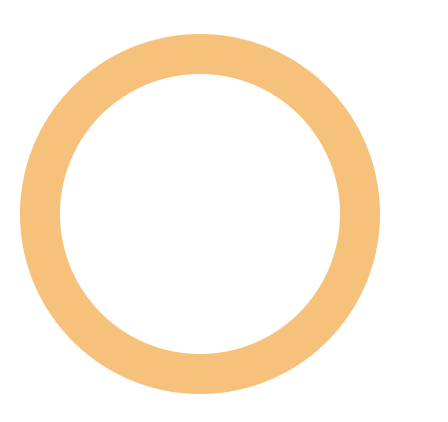
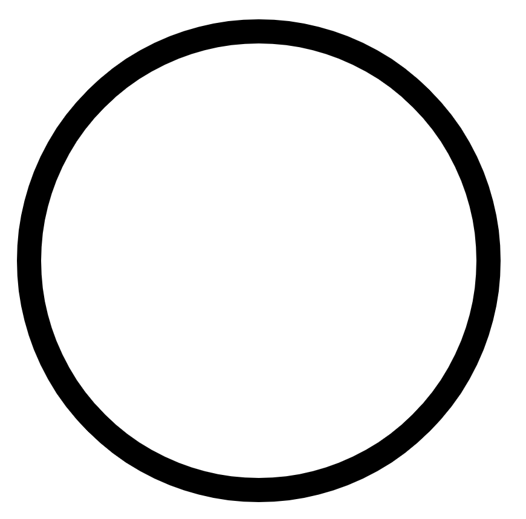

## 用svg画圆

- stroke-dasharray，表示创建虚线，其值是一个数组，表示短线长度、间距、短线长度、间距等，依次循环下去，所以当第二个数字为0时，表示间距为0
```javascript
<svg
  xmlns="http://www.w3.org/2000/svg"
>
  <circle
    cx="50"
    cy="50"
    r="40"
    fill="none"
    stroke="#ffc16e"
    stroke-width="10"
    :style="{
      'stroke-dasharray': '15, 0',
    }"
  />
</svg>
```



## [svg 基础知识](https://developer.mozilla.org/zh-CN/docs/Web/SVG/Tutorial/Introduction)
- svg 文件 是 “后来居上”，越后面的元素越可见
- viewport  改变 px 和 设备单位的比例
- 一些属性
  - rx x方位的半径
  - ry y方位的半径
  - r 圆的半径
  - cx 圆心的x未知
  - cy 圆心的y的位置
  - d path元素的形状，格式：命令+参数
    - M x y 画笔移动到x，y点，只移动画笔，不画线
    - m dx dy 
    - L x y
    - l dx dy
    - A rx ry x-axis-rotation large-arc-flag sweep-flag x y   x-axis-rotation 表示X轴转了多少， large-arc-flag表示角度大小， sweep-flag表示弧线方向
    - a rx ry x-axis-rotation large-arc-flag sweep-flag dx dy
    ```javascript
    <svg width="400" height="400" xmlns="http://www.w3.org/2000/svg">
      <path d="M 200 10 A 190 190 0 1 0 390 200 A 190 190 0 0 0 200 10"
        stroke="black"
        fill="none"
        stroke-width="20"/>
    </svg>
    ```
    

