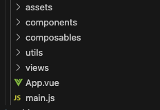
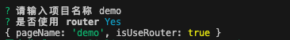

# 生成一个快速生成h5的项目

## 背景

组内日常工作是开发一些h5页面，通常情况下，每来一个需求就用vue新创建一个项目，比较麻烦。目的，创建一个项目，新需求时只需要运行指令npm run create即可快速生成一个页面

## npm run create 创建一个项目

1. npm create vue@leates  创建一个项目
2. 一个项目的结构如下图所示，那么运行指令的时候需要生成这些文件
 

3. 交互

- 通过`inquirer` 实现命令行的交互

```javascript
inquirer
  .prompt([
    {
      type: 'input',
      message:'请输入项目名称' ,
      name: 'pageName',
      validate: (pageName)=>{
        if(!pageName){
          errorLog('\n请输入页面文件夹名');
          return false
        }
        return true
      }
    },
    {
      type: 'confirm',
      message: '是否使用 router',
      name: 'isUseRouter',
    }
  ]).then(answer=>{
    ...
  })

```

- 接收 inquirer 输入的answers，根据answers开始生成项目
    - 生成项目的目录 `fs.mkdirSync(firname)`
    - 生成main.js
    ```javascript
    fs.writeFile(filepath, fileContent, 'utf8', err=>{})
    ```
    - 生成App.vue
    - 生成其他目录文件
    - 特殊文件生成
    - 生成文件的时候，需要有文件模板
    ```javascript
    // APP.vue
    (name, isUseRouter=false, isAppVue=false)=> `
      <script setup>
      // import { ref } from 'vue'
      </script>

      <template>
        ${isUseRouter ? `<RouterView />` : 
        `<div class="${name}">
          ${name}组件
        </div>`}
      </template>

      <style lang="scss" >
      #app {
        height: 100vh;
        width: 100vw;
        margin: 0;
        padding: 0;
      }
      </style>`
    ```
    ```javascript
    // main.js
    (isUseRouter, isUsePinia=false)=>`
    import { createApp } from 'vue';
    ${isUsePinia ? `import { createPinia } from 'pinia';` : ''}
    ${isUseRouter ? `import router from './router';` : ''}
    import App from './App.vue';
    import '@common/styles/reset.scss';

    const app = createApp(App);
    ${isUsePinia ? `app.use(createPinia());` : ''}
    ${isUseRouter ? `app.use(router);` : ''}
    app.mount('#app');
    `
    ```

    ```javascript
    //router.js
    (name)=>`
    import { createRouter, createWebHashHistory } from 'vue-router';
    import Index from './views/Index.vue';

    const router = createRouter({
      history: createWebHashHistory('/h5/activity/vg_activity/${name}'),
      routes: [{
        path: '/',
        component: Index,
      }, {
        path: '/:catchAll(.*)',
        redirect: '/',
      }],
    });

    export default router;
    ` 
    ```

- 通过 `chalk`实现命令行的打印，可以打印出五彩斑斓的文字

## npm run dev 运行一个项目
1. 通过inquirer再命令行中交互选择一个项目
2. 执行
devPage是项目的入口
```javascript
  shelljs.exec(`ENTRY_PATH=${devPage} vite`);
```
3. 执行发现资源404，这里需要搭配vite.config.js动态运入打包入口文件
- index.html 修改script的src
```html
  <script type="module" src="__ENTRY__"></script>
```
- vite.config.js plugins 里配置
```javascript
// 在 transformIndexHtml 钩子上动态引入打包入口文件
const getEntry = code => code.replace(
  /__ENTRY__/,
  `/src/pages/${process.env.ENTRY_PATH}/main.js`,
);

export default defineConfig({
  root: __dirname,
  ...
  plugins:[{
  name: 'transform',
  enforce: 'pre',
  transform(code, id) {
    if (id.endsWith('.html')) {
      return { code: getEntry(code), map: null };
    }
  },
  transformIndexHtml: getEntry,
  },],
  resolve:{
    alias:[
      { find: '@', replacement: path.resolve(__dirname, '/src/common') },
    ]
  },
  server:{
    port: 8080,
    open: true,
  }
  ...
})

```

## 其他配置
到此，就可以快速生成一个可用的页面了，当然还有一些功能需要完善

### 1. 大小自适应功能
通过postcss.config.cjs+rem即可实现
- 项目根目录下新增一个postcss.config.cjs文件
```
module.exports = {
  plugins: {
    'postcss-pxtorem': {
      rootValue: 37.5,
      propList: ['*'],
    },
  },
};
```
- rem.js文件
```javascript
const baseSize = 32;
function setRem() {
  const scale = document.documentElement.clientWidth / 375;
  document.documentElement.style.fontSize = `${baseSize * Math.min(scale, 2)}px`;
}
setRem();
window.onresize = function () {
  setRem();
};
```
- 在main.js中引入rem import '@common/utils/rem'，直接补充到create-h5的template里

### 2. 添加原子化样式
- 安装unocss/vite npm i @unocss/vite
- vite.config.js中配置
```javascript
import Unocss from 'unocss/vite';

export default defineConfig({
  plugin: [
    Unocss({}),
  ]
})
```
- main.js中引入 `import 'uno.css'`

### 3. 自动导入组件
- 安装依赖 npm i -D unplugin-auto-import unplugin-vue-components
  - `unplugin-auto-import/vite` 自动导入vue3的api，配置完成后运行代码会自动生成auto-import.d.ts
  - `unplugin-vue-components/vite` 自动导入自己写的组件名和流行组件库，配置完成后运行代码会自动生成components.d.ts
  - 产物通过dts 配置文件的生成位置
- 配置vite.config.js
```javascript
import Components from 'unplugin-vue-components/vite';
import AutoImport from 'unplugin-auto-import/vite';
import { ElementPlusResolver } from 'unplugin-vue-components/resolvers';

export default defineConfig({
  ...
  plugin:[
   AutoImport({
      imports: ['vue', 'vue-router'],
      dts: 'src/auto-import.d.ts',
      eslintrc: {
        enabled: false,
        filepath: './.eslintrc-auto-import.json',
        globalsPropValue: true, 
      },
    }),
    // 自动导入组件
    Components({
      dirs: ['src/components', 'src/pages'],
      resolvers: [
        ElementPlusResolver(), 
      ],
      dts: 'src/components.d.ts', // 自定义生成.d.ts位置
    }),
  ]
})
```


## 用到的npm包
- inquirer 命令行交互
- chalk 控制台打印五彩的字
- path 路径获取 `const __dirname = path.resolve();`
- fs 文件系统 `fs.existsSync(dirname)`、`fs.mkdirSync(dirname)`、`fs.writeFile(filepath, fileContent, 'utf8', callback)` 
- shelljs js中执行shell命令

## [完整项目地址](https://github.com/Ailinglove/create-h5)


