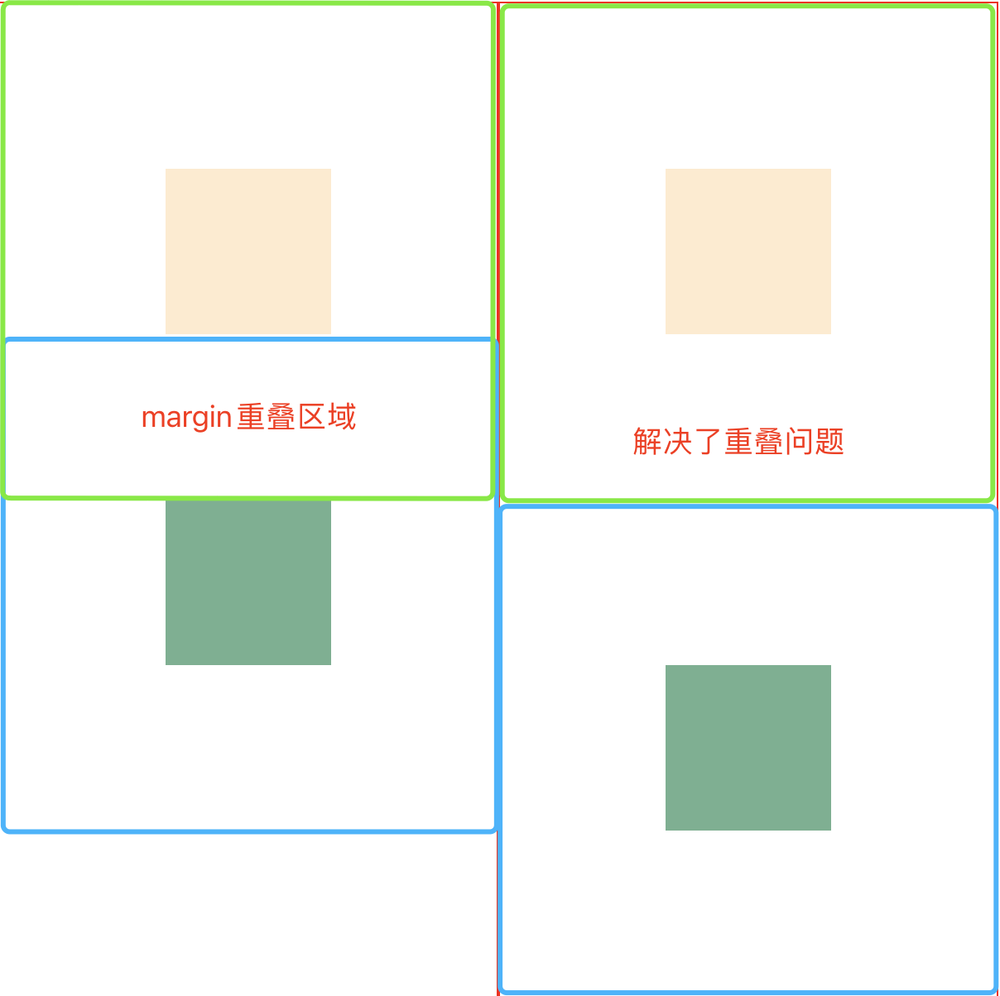

# CSS
## 实现水平垂直居中
1. position定位
-  `top: 0; left: 0; right: 0; bottom: 0;` 将元素的四个边缘与其最近的具有定位属性的父元素或视口的对应边缘对齐。这样，元素将被拉伸以填充整个父容器或视口。`maegin: auto` 是上下左右居中的关键，用于计算并分配剩余空间，使元素在水平和垂直方向都居中
```css
.parent {
  width: 200px;
  height: 200px;
  margin: 20px;
  position: relative;
}
.son {
  width: 100px;
  height: 100px;
  position: absolute;
  top: 0;
  bottom: 0;
  left: 0;
  right: 0;
  margin: auto;
}
```

- `top: 50%; left: 50%; transform: translate(-50%, -50%);` 将元素距离上、左50%后，元素会偏下和偏右，在用transform向左和上移动元素的50%
```css
/* .parent 同上  */
 .son1 {
  position: absolute;
  top: 50%;
  left: 50%;
  transform: translate(-50%, -50%);
}
```

- `top: 50%; left: 50%; margin-left: -(元素宽度/2)px; marfub-top: -(元素高度/2)px;` 意思同上
```css
/* .parent 同上  */
 .son1 {
  position: absolute;
  top: 50%;
  left: 50%;
  margin-left: -50px;
  margin-top: -50px;
}
```

2. 不用position
- flex 布局
```css
.parent{
  display: flex;
  justify-content: center;
  align-items: center;
}
```
- 通过display: tabel-cell;让子容器的内容居中
```css
.wrapper{
  display: table;
}
.parent{
  display: table-cell;
  vertical-align: middle;
  text-align: center;
}
.son{
  height: 50px;
  width: 50px;
  margin: 0 auto;
}
```

## BFC
1. 定义 BFC：Block Formatting Context 块级格式化上下文，一个BFC包含创建该上下文元素的所有自元素，但不包括创建新的BFC的字元素的内部元素

2. 触发条件
- 设置float
- 设置absolute或者fixed
- 设置 inline-block
- 设置overflow：hidden，auto，scroll
- 设置 display：table-cell、flex

3. 可以解决的问题
- 解决margin垂直方向重叠问题

右侧设置了父元素开启BFC，所以避免了垂直方向的重叠问题
- 解决父元素高度塌陷问题  当有盒子设置了float时，会导致父元素高度塌陷  
  * 为父元素开启BFC，例如设置 `overflow: hidden;`
  * 添加一个div，css样式 `clear: both;`
  * after伪类
  ```css
  .wrapper3::after {
      content: '';
      clear: both;
      /* 此时还不够: 因为::after元素是行内元素 */
      display: flex;
    }
  ```

## 响应式设计
响应式设计是为了使网站能够适应不同设备和屏幕，传统网页设计中，通常会为不同的设备创建不同的版本和布局，而响应式设计的目标是创建一个灵活的布局，能够根据用户的设备和屏幕尺寸自动调整和适应。  
响应式设计的核心原则是使用流动的布局、弹性的图像和媒体以及媒体查询来实现，通过使用css媒体查询，根据不同的屏幕宽度、高度、分辨率的特性，为不同的设备提供不同的样式和布局。  
基本原则
- 弹性网格布局
- 弹性图片和媒体
- 媒体查询
- 流式布局

## CSS选择器类型
- 标签选择器
- 类选择器
- id选择器
- 标签属性选择器 a[title="special"] a[href="https://baidu.com"]
- 伪类选择器
- 伪元素选择器
- 关系选择器
  - 后代选择器 空格 `container box`
  - 子带关系选择器 `container>box`  子代和后代的区别：子代是直接子元素，子元素的子元素不算在选择器里边
  - 领接兄弟选择器 `box + img` 选中紧随box后的img
  - 通用兄弟选择器 `box ~ img` 选中所有的同级的img

## 样式化链接
链接的状态：注意写样式的时候，这个顺序不能变，否则会产生不正确的效果 L V F H A 
- Link 没有被访问
- Visited 已经被访问
- Focus 通过 Tab 移动到链接上的样式
- Hover 鼠标光标停留在这个链接上
- Active 链接被点击

## 伪类和伪元素
- 伪类，用于选择特定状态的元素，比如某个类型的第一个元素，或者链接的激活、访问状态等，因此有:first-child, :last-child,:hover, :focus
- 伪元素 是向html中插入一个元素， 以:: 开头，特别的伪元素 ::after, ::before，和 content属性一起使用，通过css将内容插入到文档中
例如 在盒子内部的最前边，新增 `伪元素：` 三个字
```css
.box::before{
  content: '伪元素：';
}
```
通过after伪元素和content搭配，增加一个下划线
```css
.box::after{
  content: '';
  display: block;
  height: 4px;
  width: 40px;
  background-color: aquamarine;
  margin: 0 auto;
  margin-top: 4px;
}
```
